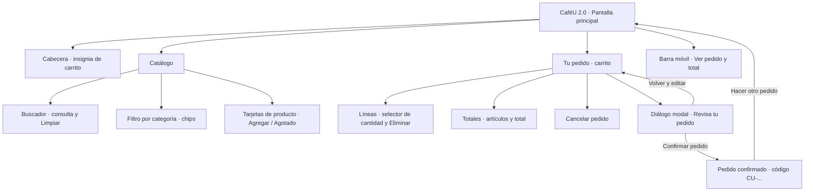

# Sitemap

CaféU 2.0 funciona en una sola página (`src/presentation/index.html`) organizada por secciones, un diálogo modal de revisión y la vista de confirmación de pedido.

```mermaid
flowchart TD
  A[CaféU 2.0 · Pantalla principal] --> H[Cabecera · insignia de carrito]
  A --> B[Catálogo]
  A --> C[Tu pedido · carrito]
  A --> M[Barra móvil · Ver pedido y total]

  B --> B1[Buscador · consulta y Limpiar]
  B --> B2[Filtro por categoría · chips]
  B --> B3[Tarjetas de producto · Agregar / Agotado]

  C --> C1[Líneas · selector de cantidad y Eliminar]
  C --> C2[Totales · artículos y total]
  C --> C3[Cancelar pedido]
  C --> D[Diálogo modal · Revisa tu pedido]

  D -->|Volver y editar| C
  D -->|Confirmar pedido| E[Pedido confirmado · código CU-...]
  E -->|Hacer otro pedido| A
```
