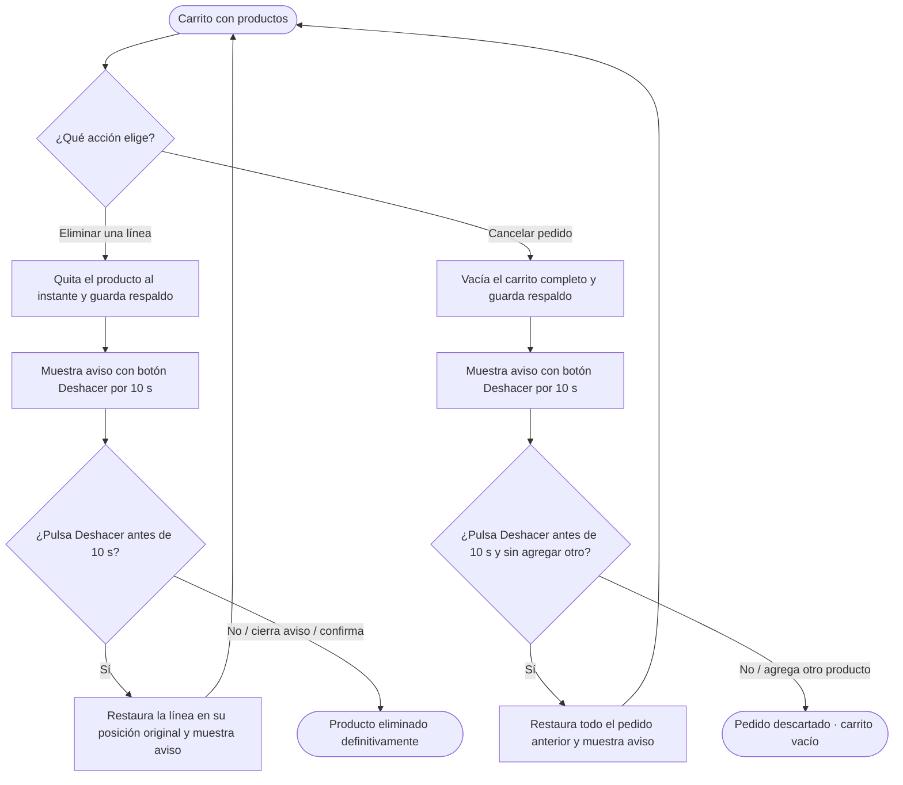

# User flows

## 1. Compra

```mermaid
flowchart TD
  I([Inicio]) --> B[Explora categorías o escribe en el buscador]
  B --> R{¿Hay resultados?}
  R -- No --> M[Muestra: No hay productos que coincidan] --> B
  R -- Sí --> D{¿Producto disponible?}
  D -- No --> AG[Tarjeta marcada como Agotado sin botón Agregar] --> B
  D -- Sí --> A[Pulsa Agregar]
  A --> AV[Actualiza carrito, insignia, barra móvil y muestra aviso]
  AV --> MC{¿Agrega más productos?}
  MC -- Sí --> B
  MC -- No --> VC[Va a Tu pedido o pulsa Ver pedido en móvil]
  VC --> RC[Pulsa Revisar y confirmar pedido]
  RC --> DL[Diálogo modal: Revisa tu pedido]
  DL --> CF{¿Confirma?}
  CF -- Volver y editar --> VC
  CF -- Confirmar pedido --> OK([Pedido confirmado · código CU-...])
```

## 2. Modificación

```mermaid
flowchart TD
  M0([Carrito con productos]) --> ACT{¿Cómo modifica?}
  ACT -- Botón − o + --> VAL{¿Dentro de 1 a 20?}
  ACT -- Escritura directa en campo --> VAL2{¿Entero entre 1 y 20?}
  VAL -- No / límite --> DIS[Botón − en 1 o + en 20 deshabilitado] --> M0
  VAL -- Sí --> UPD[Actualiza cantidad, subtotal y total; guarda en LocalStorage]
  VAL2 -- No --> ERR[Muestra error junto al campo y restaura valor anterior] --> M0
  VAL2 -- Sí --> UPD
  UPD --> REV[Pulsa Revisar y confirmar pedido]
  REV --> DL[Diálogo modal: Revisa tu pedido]
  DL --> VE{¿Desea editar algo?}
  VE -- Pulsa Volver y editar --> M0
  VE -- Confirma pedido --> OK([Pedido confirmado · código CU-...])
```

## 3. Cancelación

```mermaid
flowchart TD
  C0([Carrito con productos]) --> OP{¿Qué acción elige?}

  OP -- Eliminar una línea --> E1[Quita el producto al instante y guarda respaldo]
  E1 --> E2[Muestra aviso con botón Deshacer por 10 s]
  E2 --> E3{¿Pulsa Deshacer antes de 10 s?}
  E3 -- Sí --> E4[Restaura la línea en su posición original y muestra aviso] --> C0
  E3 -- No / cierra aviso / confirma --> E5([Producto eliminado definitivamente])

  OP -- Cancelar pedido --> K1[Vacía el carrito completo y guarda respaldo]
  K1 --> K2[Muestra aviso con botón Deshacer por 10 s]
  K2 --> K3{¿Pulsa Deshacer antes de 10 s y sin agregar otro?}
  K3 -- Sí --> K4[Restaura todo el pedido anterior y muestra aviso] --> C0
  K3 -- No / agrega otro producto --> K5([Pedido descartado · carrito vacío])
```
